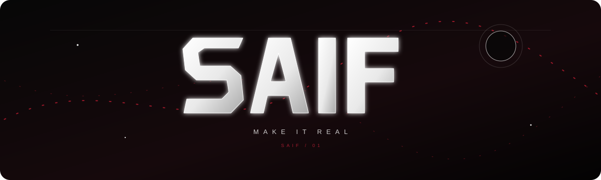

 

### software · ai · systems

> *I like turning ideas into things that work.*

 

**LANGUAGES**  
`Python` · `Java` · `JavaScript` · `C` · `C++`

**DEVELOPMENT**  
`Android` · `Node.js` · `Full-Stack` · `REST APIs`

**AI / COMPUTER VISION**  
`Machine Learning` · `Computer Vision` · `OCR` · `PaddleOCR` · `Ollama` · `Gemma 3 Vision`

**DATA & BACKEND**  
`SQL` · `MongoDB` · `Firebase`

**TOOLS**  
`Git` · `GitHub` · `VS Code` · `Android Studio` · `Linux`

 

<a href="https://github.com/mikey-eze">github</a>

